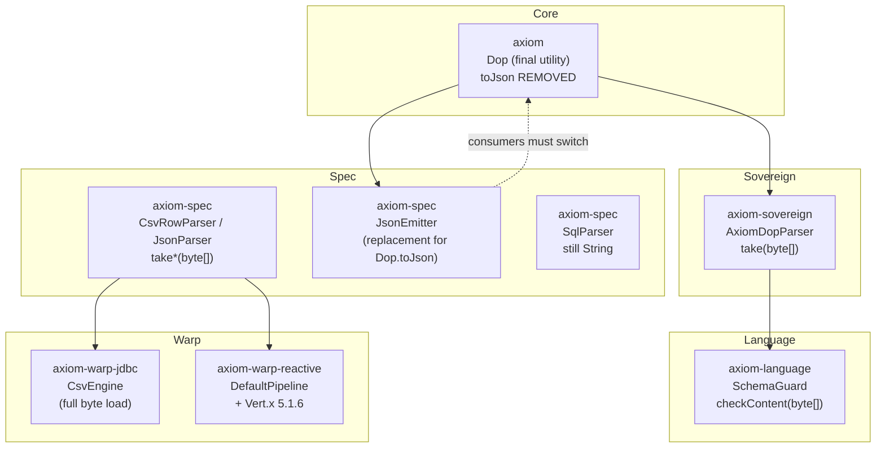
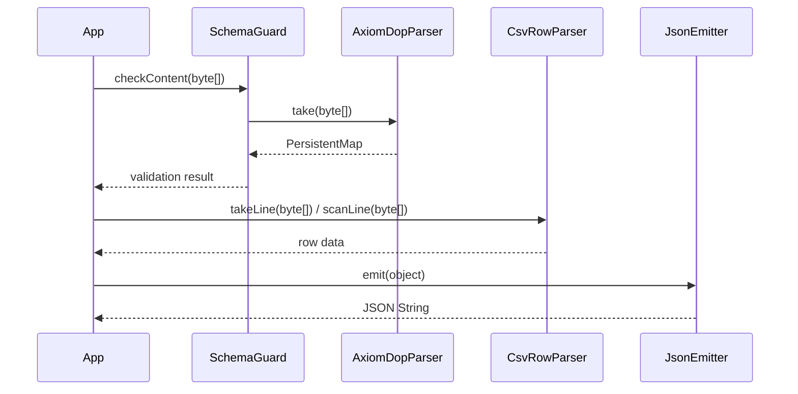

# Axiom 1.0.0 → 2.0.0 — Ultimate Release Changelog


> [!IMPORTANT]
> **This is a MAJOR release.** Public contracts changed incompatibly.
> Downstream code that calls the old `String`-based parsers or implements / uses `Dop.toJson` **will not compile** against 2.0.0 without migration.

> [!NOTE]
> **Scope of this document**  
> - All `.java` semantic changes between the two production trees  
> - Cross-module impact of each change  
> - Relevant POM / dependency updates (Vert.x, version alignment)  
> - Files that differ only by whitespace / line-endings are listed but ignored for functional impact  
> - Non-Java resources (README, LICENSE, `.idea`, etc.) are out of scope

---

## Table of Contents

1. [Why 2.0.0 (SemVer justification)](#1-why-200-semver-justification)
2. [Published artifacts](#2-published-artifacts)
3. [BREAKING CHANGES (must read)](#3-breaking-changes-must-read)
4. [Executive summary — the one big theme](#4-executive-summary--the-one-big-theme)
5. [Who must upgrade — impact matrix](#5-who-must-upgrade--impact-matrix)
6. [Module-by-module detailed changes](#6-module-by-module-detailed-changes)
7. [Cross-module dependency graph](#7-cross-module-dependency-graph)
8. [Migration guide](#8-migration-guide)
9. [Complete change inventory](#9-complete-change-inventory)
10. [Known inconsistencies / pre-release notes](#10-known-inconsistencies--pre-release-notes)
11. [Migration checklist](#11-migration-checklist)
12. [Summary dashboard](#12-summary-dashboard)

---

## 1. Why 2.0.0 (SemVer justification)

Version **2.0.0** is required because the following public contracts are binary- and source-incompatible with 1.0.0:

- Parser entry points moved from `String` to `byte[]`
- `Dop` changed from an interface to a `final` utility class
- `Dop.toJson(...)` was removed
- `SchemaGuard` signatures changed

A minor (1.1.0) or patch release would violate SemVer. All six modules are therefore published as **2.0.0**.

---

## 2. Published artifacts

All modules share the same coordinates under `com.ensemblu` and are released together:

| Artifact ID              | Group ID       | Version | Role                                      |
|--------------------------|----------------|---------|-------------------------------------------|
| `axiom`                  | `com.ensemblu` | 2.0.0   | Core foundation (Dop, data structures…)   |
| `axiom-sovereign`        | `com.ensemblu` | 2.0.0   | DOP / schema parser                       |
| `axiom-language`         | `com.ensemblu` | 2.0.0   | SchemaGuard & language layer              |
| `axiom-spec`             | `com.ensemblu` | 2.0.0   | CSV / JSON / SQL parsers + JsonEmitter    |
| `axiom-warp-jdbc`        | `com.ensemblu` | 2.0.0   | Blocking JDBC warp driver                 |
| `axiom-warp-reactive`    | `com.ensemblu` | 2.0.0   | Reactive (Vert.x) warp driver             |

Java baseline remains **26** (`<release>26</release>`).

---

## 3. BREAKING CHANGES (must read)

These six changes will break compilation for any consumer still on 1.0.0:

| # | Location | 1.0.0 | 2.0.0 | Action required |
|---|----------|-------|-------|-----------------|
| 1 | `AxiomDopParser` | `take(String)` | `take(byte[])` | Pass UTF-8 bytes |
| 2 | `CsvRowParser` | `takeLine(String)` / `scanLine(String)` | `takeLine(byte[])` / `scanLine(byte[])` | Pass UTF-8 bytes |
| 3 | `JsonParser` | `take(String)` | `take(byte[])` | Pass UTF-8 bytes |
| 4 | `SchemaGuard` | `checkContent(String)` | `checkContent(byte[])` + new `checkContent(PersistentMap)` | Prefer map overload or pass bytes |
| 5 | `Dop` | `public interface Dop` | `public final class Dop` | Cannot implement / extend |
| 6 | `Dop.toJson(...)` | Present (shallow) | **Removed** | Use `JsonEmitter.emit(...)` |

> [!CAUTION]
> **`Dop.toJson` is gone.**  
> It was a shallow, incomplete helper that only handled top-level maps and did not recurse properly into nested structures.  
> The correct, production-grade replacement has always lived in:
> ```java
> import com.ensemblu.axiom.spec.parser.JsonEmitter;
>
> String json = JsonEmitter.emit(yourObject);
> ```
> `JsonEmitter` correctly handles `PersistentMap`, `PersistentList`, nested values, escaping, `null`, numbers and booleans.

Everything else (internal CSV engine redesign, clearer JDBC error messages, Vert.x bump, ConfigSource class-loader hardening) is non-breaking for external API consumers.

---

## 4. Executive summary — the one big theme

**2.0.0 migrates the entire parsing & ingestion stack from `String` to `byte[]`.**

Goal (stated in the new `AxiomDopParser`):

> Operate natively on raw bytes to avoid intermediate string allocations.

This single decision creates a cascading contract change that touches every module that feeds or consumes parsed data.

| Layer | Change | Consequence for dependents |
|-------|--------|----------------------------|
| **Core** (`Dop`) | Interface → final utility; smarter number normalization; **`toJson` removed** | Safer identity; must switch to `JsonEmitter` |
| **Sovereign** (`AxiomDopParser`) | `take(String)` → `take(byte[])` | All schema / DOP consumers must pass bytes |
| **Language** (`SchemaGuard`) | `checkContent(String)` → `checkContent(byte[])` + map overload | Call sites must adapt |
| **Spec** (`CsvRowParser`, `JsonParser`) | All entry points become byte-based | CSV / JSON pipelines no longer allocate intermediate strings |
| **Warp-JDBC** (`CsvEngine`) | `BufferedReader` stream → full `byte[]` load + cursor | Memory profile changes; headers parsed lazily |
| **Warp-Reactive** (`DefaultPipeline`) | Line handling switched to `line.getBytes()` | Reactive CSV ingest matches the new byte contract |
| **Warp-Reactive POM** | Vert.x 5.1.5 → **5.1.6** | Dependency alignment / bug-fix pickup |

---

## 5. Who must upgrade — impact matrix

| Your usage | Urgency | What you must change |
|------------|---------|----------------------|
| Only core data structures / `Dop` helpers | Medium | Remove any `implements Dop`; replace `Dop.toJson` with `JsonEmitter.emit` |
| Schema / DOP parsing (`SchemaGuard`, `AxiomDopParser`) | **High** | Switch every `take` / `checkContent` call to `byte[]` (or use the new map overload) |
| CSV or JSON parsing (`CsvRowParser`, `JsonParser`) | **High** | Switch every entry point to `byte[]` |
| JDBC warp only (no custom parsers) | Low | Recompile against 2.0.0; clearer exception messages only |
| Reactive warp | Low–Medium | Recompile; Vert.x 5.1.6 pulled transitively; internal pipeline already updated |
| Full stack | **High** | Apply all of the above |

---

## 6. Module-by-module detailed changes

### 6.1 `axiom` (core foundation)

#### `com.ensemblu.axiom.core.foundation.Dop`

| Aspect | 1.0.0 | 2.0.0 |
|--------|-------|-------|
| Type | `public interface Dop` | `public final class Dop` |
| Instantiation | Possible (interface) | Forbidden (private constructor throws `AssertionError`) |
| Visibility | package-private static methods | All public static methods |
| Number normalization | `normalizePrimitive(double)` | Renamed → `normalizeDouble(double)` + stricter digit scanner |
| String → Number | Naive `Integer` → `Long` → `Double` cascade | Hand-written scanner with length limits (`INT_MAX_LEN=10`, `LONG_MAX_LEN=19`); rejects leading-zero integers & scientific notation |
| Nested types | package-private projectors / iteration interfaces | All made `public` |
| **`toJson`** | Present (shallow map-only helper) | **Removed** → use `JsonEmitter` |

<details>
<summary><strong>Before / After sketch (Dop)</strong></summary>

```java
// 1.0.0
public interface Dop {
    static <K, V> String toJson(PersistentMap<K, V> map) { /* shallow */ }
    // ...
}

// 2.0.0
public final class Dop {
    private Dop() { throw new AssertionError("No instances"); }
    // toJson gone — use JsonEmitter.emit(...)
    public static Object normalize(Object o) { /* stricter */ }
    // ...
}
```
</details>

**Effect on other modules:**  
Any code that implemented or subclassed `Dop` breaks. Callers of `normalize`, projectors, etc. continue to work but now see stricter numeric identity (important for map keys / equality). JSON emission must move to `axiom-spec`.

#### `com.ensemblu.axiom.core.config.ConfigSource`

- Resource loading now prefers `Thread.currentThread().getContextClassLoader()` and falls back to the defining class loader.
- More robust in multi-class-loader environments (reactive / modular runtimes).

**Effect:** Improves reliability of configuration discovery in `axiom-warp-*`; no public API change.

---

### 6.2 `axiom-sovereign`

#### `com.ensemblu.axiom.sovereign.parser.AxiomDopParser`

**Breaking API change:**

```java
// 1.0.0
public static Initial take(String content)

// 2.0.0
public static Initial take(byte[] content)
```

Internal engine rewritten:

- `String src` → `byte[] src`
- `char` peek/next → `byte` peek/next + explicit consume helpers
- String materialisation via `new String(src, start, len, StandardCharsets.UTF_8)` only when a value is actually needed
- Stricter structural validation (empty content, missing `{`, …)

**Effect cascade:**  
`SchemaGuard` and any external user of `AxiomDopParser` must supply UTF-8 bytes.

---

### 6.3 `axiom-language`

#### `com.ensemblu.axiom.schema.SchemaGuard`

**Breaking + additive:**

```java
// 1.0.0
static BasedOnSchemaInPath checkContent(String content)
WithParser.withParser(Function<String, PersistentMap<String, Object>> mapper)

// 2.0.0
static BasedOnSchemaInPath checkContent(byte[] content)                    // primary
static BasedOnSchemaInPath checkContent(PersistentMap<String, Object> data) // new overload
WithParser.withParser(Function<byte[], PersistentMap<String, Object>> mapper)
```

- Schema registry loading now passes `is.readAllBytes()` directly to `AxiomDopParser.take(...)` (no intermediate `String`).

**Effect:** Call sites that previously passed a `String` must convert to bytes **or** parse first and use the new map overload.

---

### 6.4 `axiom-spec`

#### `com.ensemblu.axiom.spec.parser.CsvRowParser`

```java
// 1.0.0
static AddHeaders takeLine(String line)
static PersistentList<String> scanLine(String line)

// 2.0.0
static AddHeaders takeLine(byte[] line)
static PersistentList<String> scanLine(byte[] line)
```

- Blank-line detection rewritten as a pure byte loop (no `String.isBlank()`).
- Scanner walks `byte[]` and casts to `char` only for comparison / accumulation.

#### `com.ensemblu.axiom.spec.parser.JsonParser`

```java
// 1.0.0
static Initial take(String json)

// 2.0.0
static Initial take(byte[] json)
```

Entire native engine converted to byte-oriented parsing (same pattern as `AxiomDopParser`).

#### `com.ensemblu.axiom.spec.parser.JsonEmitter`

- **Unchanged** between 1.0.0 and 2.0.0 (identical source).
- Now the **only** supported way to emit JSON after the removal of `Dop.toJson`.
- Correctly handles nested maps/lists, escaping, nulls, numbers and booleans.

| Capability | Old `Dop.toJson` | `JsonEmitter.emit` |
|------------|------------------|--------------------|
| Top-level map | Yes (shallow) | Yes |
| Nested structures | No | Yes |
| Lists | No | Yes |
| Proper string escaping | Partial | Yes |
| null / boolean / number | Limited | Yes |

#### `com.ensemblu.axiom.spec.parser.SqlParser`

- API still `forge(String template)` — **not** migrated to bytes.
- Javadoc updated to mention “natively via byte arrays”, which does **not** match the current implementation.
- Unused `StandardCharsets` import present in 2.0.0.
- See [Known inconsistencies](#10-known-inconsistencies--pre-release-notes).

**Effect cascade:**  
`axiom-warp-jdbc.CsvEngine` and `axiom-warp-reactive.DefaultPipeline` were forced to switch to the new byte APIs of `CsvRowParser` / `JsonParser`.

---

### 6.5 `axiom-warp-jdbc`

#### `com.ensemblu.axiom.jdbc.io.CsvEngine`

Major internal redesign of `CsvStream`:

| 1.0.0 | 2.0.0 |
|-------|-------|
| `BufferedReader` + line-by-line | Full `byte[] content = is.readAllBytes()` |
| Headers parsed immediately | Headers parsed lazily via `initializeFileHeadersIfNeeded()` |
| `String nextLine` | `byte[] nextRowBytes` + cursor |
| — | New factory `CsvStream.of(byte[], PersistentList<String>)` |

Resource handling improved with try-with-resources.

#### `com.ensemblu.axiom.jdbc.scope.WarpScope`

- Explicit `SQLException` handling when obtaining a connection.
- Distinct failure messages: “Establish a connection … FAILED” vs “Strike execution FAILED”.
- Proper `InterruptedException` handling (restores interrupt flag).

**Effect:** More precise error reporting and safer parallel execution; no public API break.

---

### 6.6 `axiom-warp-reactive`

#### `com.ensemblu.axiom.reactive.ingest.DefaultPipeline`

- Line processing changed from `line.toString().trim()` to `line.getBytes()`.
- Blank detection rewritten as a pure byte loop (consistent with `CsvRowParser`).
- Calls `CsvRowParser.scanLine(byte[])` and `CsvRowParser.takeLine(byte[])`.

**Effect:** Reactive CSV ingestion is now zero-copy end-to-end and consistent with the rest of the stack.

#### POM — Vert.x bump

| Property | 1.0.0 | 2.0.0 |
|----------|-------|-------|
| Vert.x | `vertx-core.version` = 5.1.5<br>`vertx-sql-client.version` = 5.1.5 | Single `vertx.version` = **5.1.6** |

Properties consolidated; both `vertx-core` and `vertx-sql-client` now resolve from the same version property.

---

## 7. Cross-module dependency graph



**Critical dependency chain:**  
Any change to the `byte[]` contract in `AxiomDopParser` / `CsvRowParser` / `JsonParser` **must** be mirrored in every consumer. Version 2.0.0 performs this migration consistently across the five modules that participate in the parsing pipeline.



---

## 8. Migration guide

### Step-by-step

1. **Bump all Axiom dependencies to 2.0.0**  
   ```xml
   <dependency>
       <groupId>com.ensemblu</groupId>
       <artifactId>axiom-…</artifactId>
       <version>2.0.0</version>
   </dependency>
   ```

2. **Replace every `AxiomDopParser.take(string)`**  
   ```java
   AxiomDopParser.take(content.getBytes(StandardCharsets.UTF_8));
   // or, if you already have bytes:
   AxiomDopParser.take(rawBytes);
   ```

3. **Replace `SchemaGuard.checkContent(string)`**  
   - Prefer the new overload if you already have a `PersistentMap`.  
   - Otherwise pass UTF-8 bytes.

4. **CSV / JSON entry points**  
   ```java
   CsvRowParser.takeLine(lineBytes);
   CsvRowParser.scanLine(lineBytes);
   JsonParser.take(jsonBytes);
   ```

5. **Remove any `implements Dop` / `extends Dop`**  
   `Dop` is now a final utility class.

6. **Replace `Dop.toJson(...)`**  
   ```java
   import com.ensemblu.axiom.spec.parser.JsonEmitter;

   String json = JsonEmitter.emit(myMapOrListOrValue);
   ```

7. **Re-test numeric equality / map keys**  
   `Dop.normalize` is stricter (leading zeros, scientific notation, length limits).

8. **Reactive users**  
   Vert.x 5.1.6 is pulled automatically; no extra code change required beyond the pipeline already present in 2.0.0.

---

## 9. Complete change inventory

| # | Module | File | Kind | Breaking? | Summary |
|---|--------|------|------|-----------|---------|
| 1 | axiom | `Dop.java` | Semantic | **Yes** | interface → final class; stricter normalize; **toJson removed** |
| 2 | axiom | `ConfigSource.java` | Semantic | No | Context class-loader preference |
| 3 | axiom-sovereign | `AxiomDopParser.java` | Semantic | **Yes** | `take(String)` → `take(byte[])` |
| 4 | axiom-language | `SchemaGuard.java` | Semantic | **Yes** | `checkContent` → byte[] + new map overload |
| 5 | axiom-spec | `CsvRowParser.java` | Semantic | **Yes** | `takeLine` / `scanLine` → byte[] |
| 6 | axiom-spec | `JsonParser.java` | Semantic | **Yes** | `take(String)` → `take(byte[])` |
| 7 | axiom-spec | `SqlParser.java` | Cosmetic + javadoc | No* | Whitespace + misleading javadoc (*see note) |
| 8 | axiom-warp-jdbc | `CsvEngine.java` | Semantic (internal) | No | Full-byte CSV engine |
| 9 | axiom-warp-jdbc | `WarpScope.java` | Semantic (internal) | No | Clearer errors + interrupt handling |
| 10 | axiom-warp-reactive | `DefaultPipeline.java` | Semantic (internal) | No | Byte-oriented line handling |
| 11 | axiom-warp-reactive | `pom.xml` | Dependency | No | Vert.x 5.1.5 → **5.1.6** |

**Whitespace-only / ignored for functional migration:**

- `If.java`, `CheckFlow.java`, `ResultBehavior.java`, `Effect.java`, `Nothing.java`, `ConsoleOutputEffect.java`, `FileUtils.java` (mostly)

---

## 10. Known inconsistencies / pre-release notes

> [!WARNING]
> **`SqlParser` contract mismatch**  
> - Public API remains `forge(String template)`.  
> - Class-level javadoc now claims “natively via byte arrays”.  
> - An unused `import java.nio.charset.StandardCharsets;` is present.  
> **Recommendation before Maven Central:** either finish the byte migration for `SqlParser` or revert the javadoc / remove the unused import so the published contract is truthful.

> [!TIP]
> All other parser entry points (`AxiomDopParser`, `CsvRowParser`, `JsonParser`) and their internal call sites inside the warp modules are consistent with the new byte-oriented design.

---

## 11. Migration checklist

Use this as a pre-release / pre-upgrade gate:

- [ ] All six artifacts declared as version `2.0.0`
- [ ] No remaining calls to `AxiomDopParser.take(String)`
- [ ] No remaining calls to `CsvRowParser.takeLine(String)` / `scanLine(String)`
- [ ] No remaining calls to `JsonParser.take(String)`
- [ ] No remaining calls to `SchemaGuard.checkContent(String)`
- [ ] No `implements Dop` / `extends Dop`
- [ ] All former `Dop.toJson(...)` sites replaced with `JsonEmitter.emit(...)`
- [ ] Numeric equality / map-key tests re-run against stricter `Dop.normalize`
- [ ] `SqlParser` javadoc / unused import cleaned (or byte migration completed)
- [ ] Reactive module resolves Vert.x **5.1.6**
- [ ] GPG signing + Central publishing plugin verified for every module
- [ ] Smoke-tested: schema load, CSV ingest (JDBC + reactive), JSON parse/emit

---

## 12. Summary dashboard

| Module               | Real semantic files | Breaking public API? | Primary theme                                      |
|----------------------|---------------------|----------------------|----------------------------------------------------|
| axiom                | 2                   | **Yes** (Dop)        | Final utility + stricter normalize + **toJson removed** |
| axiom-sovereign      | 1                   | **Yes**              | String → byte[] parser                             |
| axiom-language       | 1                   | **Yes**              | SchemaGuard adapts to byte[]                       |
| axiom-spec           | 2 (+ JsonEmitter)   | **Yes**              | CsvRowParser + JsonParser → byte[]; JsonEmitter is the JSON exit |
| axiom-warp-jdbc      | 2                   | Internal only        | Full-byte CSV engine + better errors               |
| axiom-warp-reactive  | 1 + POM             | Internal only        | Byte pipeline + Vert.x 5.1.6                       |

---

**Bottom line**

2.0.0 is a focused, coherent performance and correctness release centered on eliminating intermediate `String` allocations in the parsing pipeline. The necessary API adjustments have been propagated consistently across all dependent modules, the shallow `Dop.toJson` has been retired in favour of the proper `JsonEmitter`, and the reactive stack rides Vert.x 5.1.6.

After addressing the small `SqlParser` javadoc/import inconsistency, the release is ready for Maven Central.